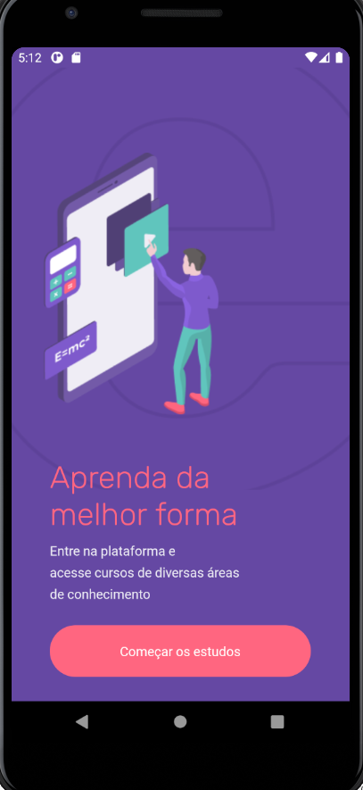
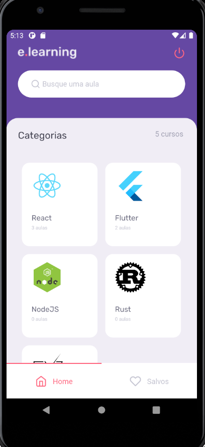
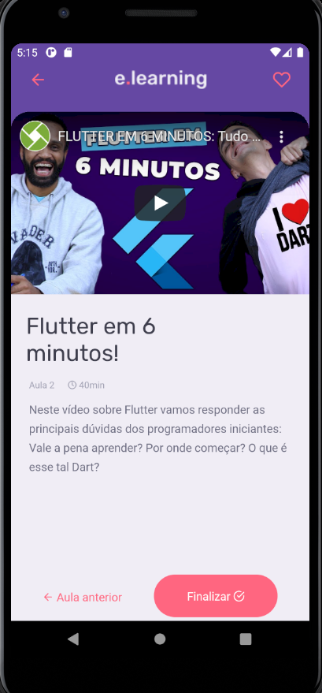
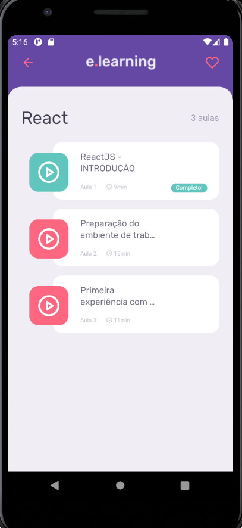

<h1 align="center">
    
    <br>
    E-Learning React Native
</h1>

<h4 align="center">
  A React Native App that allows users to watch lessons from specific courses, mark lessons as completed and save favorite courses
</h4>

<p align="center">
  <a href="#rocket-technologies">Technologies</a>&nbsp;&nbsp;&nbsp;|&nbsp;&nbsp;&nbsp;
  <a href="#information_source-how-to-use">How To Use</a>&nbsp;&nbsp;&nbsp;|&nbsp;&nbsp;&nbsp;
  <a href="#iphone-screenshots">Screens</a>&nbsp;&nbsp;&nbsp;|&nbsp;&nbsp;&nbsp;
  <a href="#memo-license">License</a>
</p>

## :rocket: Technologies

This project was developed exclusively for Android as bonus app received after completing [RocketSeat GoStack Bootcamp](https://rocketseat.com.br/bootcamp) with the following technologies:

- [ReactJS](https://reactjs.org/)
- [react-navigation](https://reactnavigation.org/)
- [react-native-gesture-handler](https://github.com/kmagiera/react-native-gesture-handler)
- [React Hooks](https://reactjs.org/docs/hooks-intro.html)
- [styled-components](https://www.styled-components.com/)
- [Axios](https://github.com/axios/axios)
- [react-native-vector-icons](https://github.com/oblador/react-native-vector-icons)
- [react-native-device-info](https://github.com/react-native-device-info/react-native-device-info)
- [react-native-webview](https://github.com/react-native-webview/react-native-webview)
- [AsyncStorage](https://react-native-async-storage.github.io/async-storage)
- [typescript-eslint](https://github.com/typescript-eslint/typescript-eslint)
- [VS Code][vc] with [EditorConfig][vceditconfig] and [ESLint][vceslint]

## :information_source: How To Use

To clone and run this application, you'll need [Git](https://git-scm.com), [Node.js v12.16][nodejs] or higher + [Yarn v1.22][yarn] or higher installed on your computer and the [E-Learning API](https://github.com/furuhata97/ELearning-back). From your command line:

```bash
# Clone this repository
$ git clone https://github.com/furuhata97/Elearning-app

# Go into the repository
$ cd Elearning-app

# Install dependencies
$ yarn install

# Start Expo Server
$ yarn start

# Run the app (Android)
$ yarn android
```

## :iphone: Technologies







## :memo: License

This project is under the MIT license. See the [LICENSE](https://github.com/furuhata97/Elearning-app/blob/main/LICENSE) for more information.

---

Made by Gustavo Furuhata :wave: [Get in touch!](https://www.linkedin.com/in/gustavo-furuhata/)

[nodejs]: https://nodejs.org/
[yarn]: https://yarnpkg.com/
[vc]: https://code.visualstudio.com/
[vceditconfig]: https://marketplace.visualstudio.com/items?itemName=EditorConfig.EditorConfig
[vceslint]: https://marketplace.visualstudio.com/items?itemName=dbaeumer.vscode-eslint
